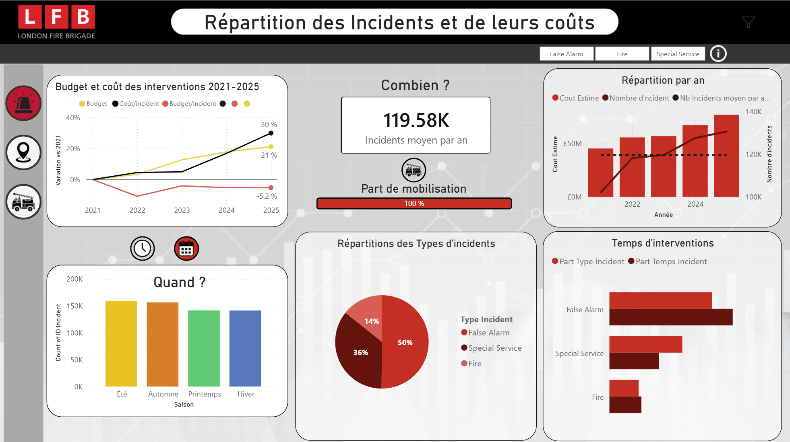
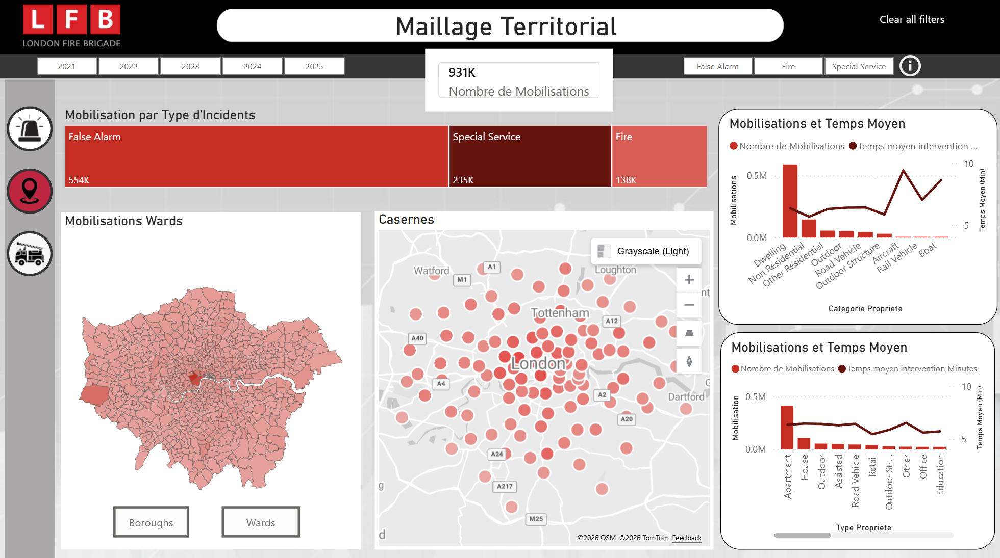
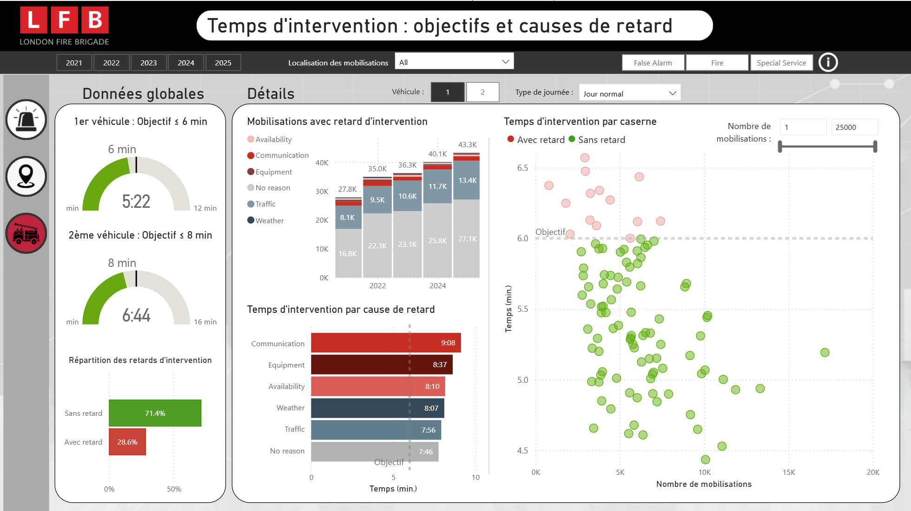

# Analyse des interventions de la London Fire Brigade (LFB)

## Présentation du projet
Ce projet analyse les données d'interventions des pompiers de Londres pour identifier les tendances et optimiser les temps de réponse.
Projet réalisé en collaboration avec Gaëtan S. et Clément R. dans le cadre de la formation "Data Analyst" Liora - Mines Paris PSL (ex - DataScientest).

Les principaux objectifs du projet agréés par l’équipe sont : 
- présenter un état des lieux des interventions de la LFB sur une période récente,
- analyser en profondeur l’activité, les performances et les aspects budgétaires de l’activité et en tirer des pistes de réflexion 
- identifier les causes qui retardent le temps d’intervention, isoler les éléments sur lesquels des actions peuvent être entreprises 
- émettre des préconisations d’améliorations du service (optimiser le temps d’intervention) ou son efficacité budgétaire 
Bien que ce projet s'inscrive dans un cadre de service public, nous l'avons abordé en partie avec une logique de service marchand en plaçant la performance budgétaire et l'optimisation des ressources au centre de l'analyse. La finalité est d’utiliser ce projet pour apprendre comment les outils de data science peuvent identifier 
des leviers d'efficience directement transposables aux enjeux de rentabilité en entreprise.

## Contenu du dépôt
- **Notebooks** : Analyse exploratoire des données (EDA) et nettoyage en Python.
- **Rapport PDF** : [Cliquez ici pour consulter le rapport complet](./reports/Projet LFB - Groupe 1 - DAB Fev 26 - Rendu Final - Arnaud - 20260330.pdf).
- **Power BI** : Le fichier source `.pbix` est disponible dans le dossier `/dashboard`.

## Aperçu du Tableau de Bord

## Comment utiliser ce projet
1. Clonez le dépôt.
2. Pour le Power BI : Ouvrez le fichier avec Power BI Desktop.
3. Pour les Notebooks : Installez les dépendances via `pip install -r requirements.txt`.

## Rapport en ligne
https://app.powerbi.com/view?r=eyJrIjoiZTcwYzVlZTUtZDZmYS00YjQwLWIxODEtMjUxYTkwZDU4MzlkIiwidCI6IjI3YThmZjFkLTc1YTAtNGFlNC1hNTg2LTMxN2NlOWVhYWZmYiJ9

